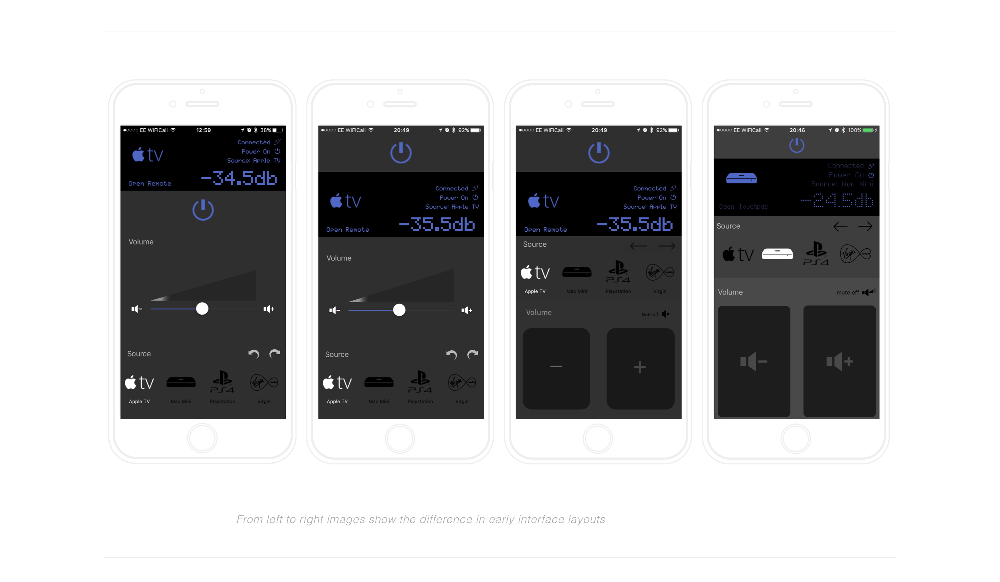

# mc_deviceMockUp
A Wordpress plugin which provides a responsive device mock up wrapper around images to simulate the appearance of a screenshot on device




## Getting Started

These instructions will get you a copy of the project up and running on your local machine for development and testing purposes. See deployment for notes on how to deploy the project on a live system.

### Prerequisites

Wordpress

### Installing

click on clone or download button and then click on Download Zip button.

Go to WordPress admin area and go to Plugins > Add New.

You will need to manually upload the plugin from your computer. To do that, click on the upload button.

Once it is done you will see a success message. You can then click on Activate Plugin link to activate the plugin on your site.

Alternatively, move the downloaded extracted folder into your your wp-contents/plugins/ folder. 

Then go into Plugins > Installed Plugins and activate the plugin there. 

### Usage

The plugin gives you a shortcode to use in the Wordpress editor. Simplest way to use it is to simply wrap one or more consectutively placed images within a pair of enclosing shortcodes
```
[mc_deviceMockUp]

// images go here

[/mc_deviceMockUp]
```
This will default to an iPhone 6 layout.

To add further options, attributes can be added:

```
[mc_deviceMockUp caption="my caption goes here "]
```
Adds a caption

```
[mc_deviceMockUp styles="width:50%"]
```
Adds styles to the container

```
[mc_deviceMockUp model="iphone-6"]
```
Sets the device mock up to use (model affects all images in the container)

```
[mc_deviceMockUp models="iphone-6,iphone-6plus,apple-watch"]
```
Sets the device mock up to use on a per image basis (models affects a single image for all specified in the container)

## Updates

* 0.1 working-ish
* 0.2 bug fixes to original code, adds in class to html to detect if models are the same or distinct, allows videos to be used in the wrap, adds in a class to html based on number of items in the shortcode block, adds readme.md 
* 0.3 to do: switch to owl carousel gallery for mobile devices for better experience. Add in models for iPhone X, iPad generic Android

## Contributing

Please read [CONTRIBUTING.md](https://gist.github.com/PurpleBooth/b24679402957c63ec426) for details on our code of conduct, and the process for submitting pull requests to us.

## Authors

* **Mark Cormack** - *Initial work* - [elmarko](https://github.com/elmarko)

See also the list of [contributors](https://github.com/your/project/contributors) who participated in this project.

## License

This project is licensed under the MIT License - see the [LICENSE.md](LICENSE.md) file for details

